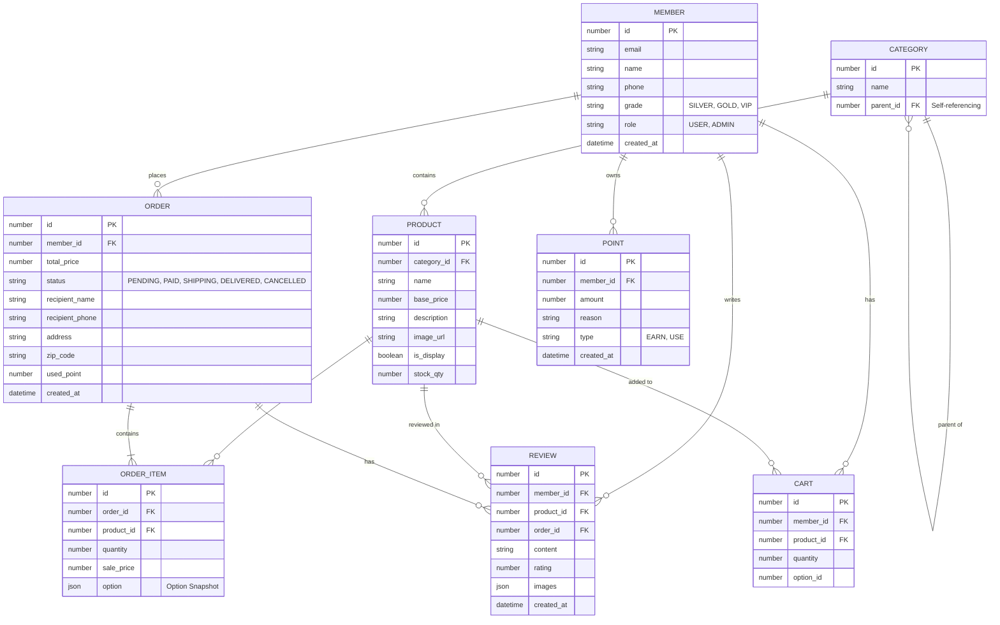

# 📊 NADA COFFEE - ERD (Entity Relationship Diagram)

이 문서는 프론트엔드 API 호출 구조와 타입 정의를 기반으로 역설계(Reverse Engineering)한 데이터베이스 구조도입니다.

---

## 1. Mermaid 다이어그램 (Markdown 뷰어용)



---

## 2. HTML 뷰어 코드 (브라우저 실행용)

아래 코드를 복사하여 `erd.html` 파일로 저장하면 브라우저에서 ERD를 시각적으로 확인할 수 있습니다.

```html
<!DOCTYPE html>
<html lang="ko">
<head>
    <meta charset="UTF-8">
    <title>NADA COFFEE ERD</title>
    <script type="module">
        import mermaid from 'https://cdn.jsdelivr.net/npm/mermaid@10/dist/mermaid.esm.min.mjs';
        mermaid.initialize({ startOnLoad: true, theme: 'default' });
    </script>
    <style>
        body { font-family: sans-serif; display: flex; flex-direction: column; align-items: center; padding: 20px; background: #f9f9f9; }
        h1 { color: #333; }
        .mermaid { background: white; padding: 20px; border-radius: 10px; box-shadow: 0 4px 6px rgba(0,0,0,0.1); width: 100%; max-width: 1200px; display: flex; justify-content: center; }
    </style>
</head>
<body>
    <h1>📊 NADA COFFEE Database Structure</h1>
    <div class="mermaid">
        erDiagram
            MEMBER {
                number id PK
                string email
                string name
                string phone
                string grade
                string role
                datetime created_at
            }
            PRODUCT {
                number id PK
                number category_id FK
                string name
                number base_price
                string image_url
                boolean is_display
            }
            CATEGORY {
                number id PK
                string name
                number parent_id FK
            }
            ORDER {
                number id PK
                number member_id FK
                number total_price
                string status
                string address
                datetime created_at
            }
            ORDER_ITEM {
                number id PK
                number order_id FK
                number product_id FK
                number quantity
                number sale_price
            }
            CART {
                number id PK
                number member_id FK
                number product_id FK
                number quantity
            }
            REVIEW {
                number id PK
                number member_id FK
                number product_id FK
                string content
                number rating
            }
            POINT {
                number id PK
                number member_id FK
                number amount
                string reason
            }

            MEMBER ||--o{ ORDER : "1:N"
            MEMBER ||--o{ CART : "1:N"
            MEMBER ||--o{ REVIEW : "1:N"
            MEMBER ||--o{ POINT : "1:N"
            CATEGORY ||--o{ PRODUCT : "1:N"
            PRODUCT ||--o{ ORDER_ITEM : "1:N"
            PRODUCT ||--o{ CART : "1:N"
            PRODUCT ||--o{ REVIEW : "1:N"
            ORDER ||--|{ ORDER_ITEM : "1:N"
    </div>
</body>
</html>
```
